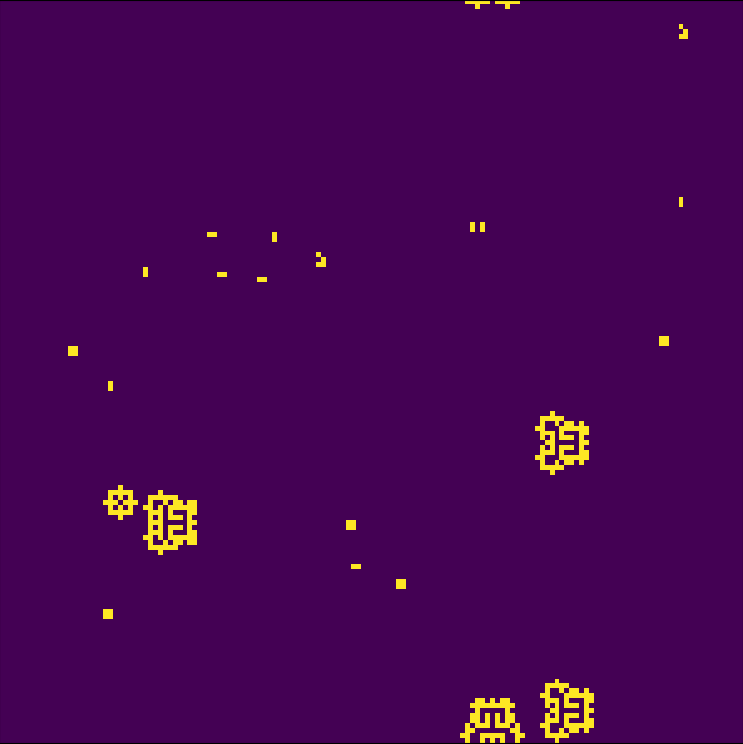

# Game of Life
A python implementation of Conway's Game of Life.

Clone or download the repository, and execute the main.py file. You can play changing the parameters of the Game class, and you can either change the rules in the rules.json file, where the first number of the key is the state of the cell, and the sencond one is the number of living cells in the neighborhood. By default the rules are set to the original 23/3.

