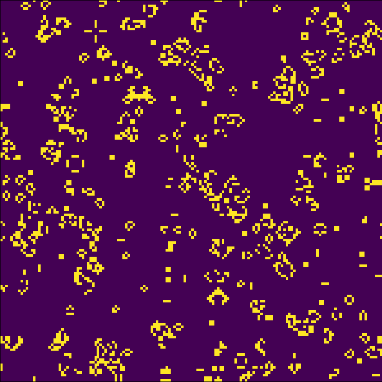
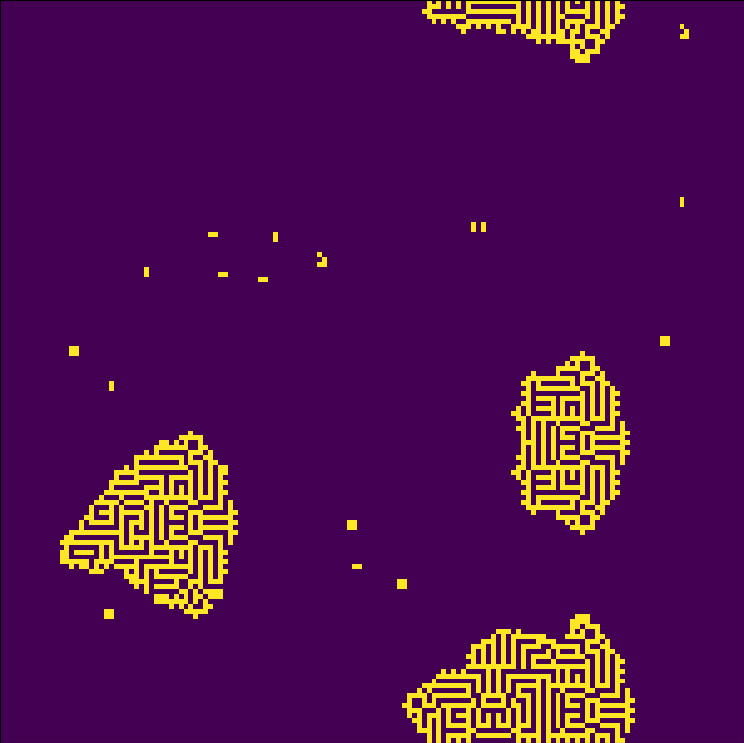
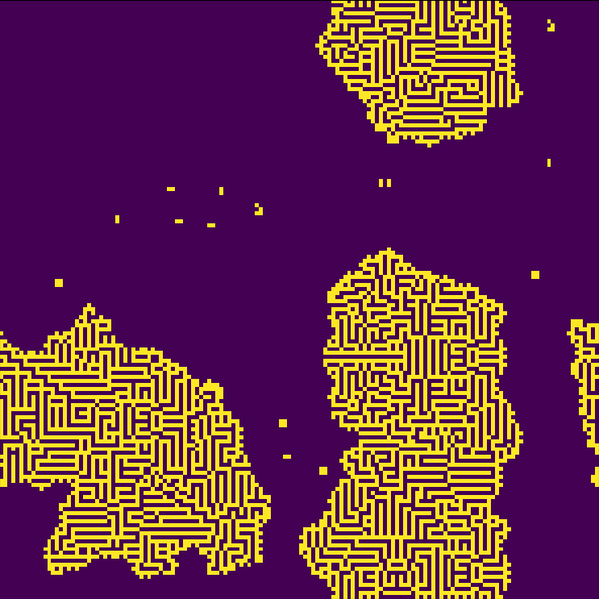

# Game of Life
A python implementation of Conway's Game of Life.

Clone or download the repository and run the main.py file. You can play by changing the parameters of the Game class, or changing the game rules in the rules.json file, where the first key number is the cell state and the second is the number of living cells in the neighborhood. By default the rules are set to the original 23/3.

The state of the game can be seen in the figure below

The next figures are different states of the game for the rule 12345/3

